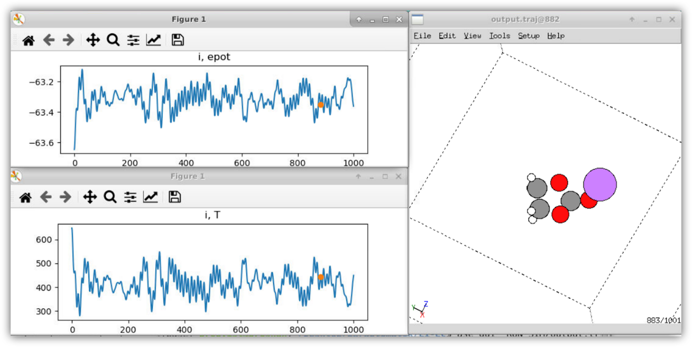

# **ParAutomatik**
## **Table of Contents**
- [**ParAutomatik**](#parautomatik)
  - [**Table of Contents**](#table-of-contents)
- [**Background**](#background)
    - [**Summary**](#summary)
    - [**Scientific Problem**](#scientific-problem)
  - [**ML-enhanced SCC-DFTB Model**](#ml-enhanced-scc-dftb-model)
  - [**Automated Workflow**](#automated-workflow)
  - [**Results**](#results)
  - [**Concluding remarks**](#concluding-remarks)
    - [**References**](#references)
- [**Installation**](#installation)
  - [**HowTo**](#howto)
- [Contact](#contact)

# **Background** 
### **Summary**

- *App title:* ParAutomatik
- *Programming Language:* Python
- *External routines/libraries:* ASE, DFTB+, skprogs, CCS, PiNN
- *Nature of problem:* Theoretical studies of redox reactions generally require the use of quantum chemical methods. These are, however, computationally expensive. Semi-empirical quantum methods are at least two orders of magnitude faster, but often display badpoor transferability, and the generation of new models is often very time-consuming.   
- *Solution method:* ParAutomatik is an automatic workflow in the form of a set of weakly connected Jupyter notebooks. The output is a machine-learning enhanced self-consistent charge density-functional based tight-binding (SCC-DFTB) model. 

### **Scientific Problem**

The build-up (and degradation) of a solid electrolyte interphase (SEI) on the anode in standard Li-ion batteries occurs via a complex, and to a large extent unknown, set of potential (and thermally) driven chemical reactions.  To gather a better understanding of the chemical reactions and the energy landscape, and possibly find routes to control the reaction dynamics and SEI formation, both experimental and theoretical efforts are needed. It is clear that such methods must be able to deliver high fidelity results and –most likely– with atomistic detail. Most experimental techniques do not meet these requirements. At the same time, while computational methods can be very acute, they suffer from other limitations. For example, size- and time scales and the material and process complexities that electronic structure calculations calculatare often far from those present in experiments, and accounting for irregularities such as defects and other impurities is difficult. New tools are needed to overcome these size, time and complexity gaps between experiment and theory. 

<figure>
   
   <figcaption class="figure-caption text-center"><b>Figure 1</b> Initial steps assumed to occur during the breakdown of EC leading to the formation of LEDC and LEMC.</figcaption>
</figure>


The scientific problem in focus here is to create a tool that enables the computation of energetics and kinetic parameters for electrolyte degradation reactions but also of structure, electronic bandgaps and mechanistic properties. One such degradation reaction starts from Ethylene Carbonate (EC) and involves its reaction with Li at low potentials. A possible reaction scheme is schematically illustrated in **Figure 1**. In the figure, the EC molecule reacts with Li<sup>+</sup> and e<sup>–</sup> to form Lithium Ethylene DiCarbonate (LEDC) which further decomposes to Lithium Ethylene monocarbonate (LEMC) and CO<sub>2</sub>. The LEMC is then believed to further react and, in the end, add to the SEI interphase in the form of solid Lithium carbonates or Lithium oxides. 

## **ML-enhanced SCC-DFTB Model**
To simulate reaction schemes like the one outlined in Figure 1 a reactive model capable of treating electron transfer is needed. The model, therefore, needs to be based on the principles of quantum mechanics and contain the electrons. The basis of our model is the Self-Consistent Charge Density Functional based Tight Binding method (SCC-DFTB) [1], which withstandard settings is up to two orders of magnitude faster than standard DFT. For hybrid density functionals, which are often needed to obtain accurate energetics in charge transfer reactions, the speed-up can be even larger. The SCC-DFTB method has been shown to be able to well capture electronic properties but is weaker on energetics, in particular for transition states during chemical reactions. In this work, we use a machine learning model to overcome such problems and enhance the SCC-DFTB method to mimic its better equipped mother, the DFT method.  

Following the standard convention within the DFTB community, we express the total energy as follows (in the formulas below "DFTB" stands for "SCC-DFTB"): 

&emsp; E<sup>tot, DFTB</sup> = E<sup>BS, DFTB</sup> + E<sup>SCC, DFTB</sup> + E<sup>rep, DFTB</sup> &nbsp;&nbsp;&nbsp;&nbsp;    [eq. 1]

Here, E<sup>BS</sup> and E<sup>SCC</sup> are the electronic band structure energy term and the energy term associated with the self-consistent charge contributions, respectively. Erep is the so-called repulsive energy that contains nuclei-nuclei repulsion, thereby its name, but more importantly all other energy contributions missing in the tight-binding approximation. In most DFTB formulations, E<sup>rep</sup> is a short-ranged pair-wise two-body potential obtained via: 
 
&emsp; E<sup>rep, DFTB</sup>  =  E<sup>tot, DFT</sup> – E<sup>BS, DFTB</sup>  –  E<sup>SCC, DFTB</sup>  &nbsp;&nbsp;&nbsp;&nbsp;	[eq. 2]

Lately, we have developed a method to obtain a model for Erep in a single shot using quadratic programming [2]. Thus with our Curvature Constrained Splines (CCS) method, we are able to avoid the otherwise cumbersome parameterization of the two-body potential, thereby saving a lot of time. Given the fact that we now are able to obtain the best “near-sighted” two-body potential for any given set of data, i.e. we have 

&emsp; E<sup>rep, CCS</sup>  ≈   E<sup>rep, DFTB</sup>         &nbsp;&nbsp;&nbsp;&nbsp;          [eq. 3]

which now yields

&emsp; E<sup>tot, DFTB'</sup> = E<sup>BS, DFTB</sup> + E<sup>SCC, DFTB</sup> + E<sup>rep, CCS</sup>   &nbsp;&nbsp;&nbsp;&nbsp; 	[eq. 1'] 

We can thus define an effective many-body term  E<sup>MB</sup> that will capture any remaining discrepencies between the as 

&emsp; E<sup>MB</sup>  = E<sup>tot, DFT</sup> – E<sup>tot, DFTB'</sup>  &nbsp;&nbsp;&nbsp;&nbsp; 	[eq. 4]

Here, any many-body expression can be used for modelling E<sup>MB</sup>. In the workflow presented here, we use a machine learning force field for this purpose. More specifically, we use the PiNN model developed by Shao et al. [3]. PiNN builds on TensorFlow, which makes the method very efficient in terms of data handling and computation and enables the use of GPU technologies in the training of the machine learning potential. We finally thus have our final  SSC-DFTB-CCS-MB model
	
&emsp; E<sup>tot, DFTB"</sup>= E<sup>tot, SSC-DFTB-CCS-ML</sup> = E<sup>BS, DFTB</sup>  +  E<sup>SCC, DFTB</sup>  +  E<sup>rep, CCS</sup>   +  E<sup>MB</sup>  &nbsp;&nbsp;&nbsp;&nbsp;	[eq. 5] 

The workflow to obtain these various parts are discussed in  the next section.

## **Automated Workflow**
To generate final approximate and efficient model with a parameter set that that is consistent with an underlying reference DFT method, we have constructed a set of Jupyter notebooks that works seamlessly with the Atomistic Simulation Environment (ASE) [4]. The collection is named ParAutomatik for automatic parameterizations. The workflow is schematically illustrated in **Figure 2**. As it builds on connected Jupyter notebooks rather than just one, it is modular in that sense that it is easy to remove and add sub-models. 

 
<figure>
   
   <figcaption class="figure-caption text-center"><b>Figure 2</b> Schematic illustration of the workflow for automatic generation of an SCC-DFTB-CCS-ML model for large-scale atomistic simulation. The final model can handle reactivity and redox activity. The ParAutomatik workflow works seamlessly with ASE.</figcaption>
</figure>


The input is a training set in the form of an ASE database, containing at a minimum a set of structures and corresponding DFT energies. Additionally, forces may be added and used in the training of the ML-force field. Another feature of flexibility in the workflow is that the level of electronic structure desired in the DFTB calculations (E<sup>tot, DFTB</sup>) can be fine-tuned by adjusting some of the parameters controlling the matrix elements in the so-called Slater-Koster tables. However, for normal use, this is not necessary. The workflow starts with the generation of the Slater-Koster tables and all other parameters needed for the SCC-DFTB calculation. Here, *ParAutomatik* works as a wrapper for the skprogs software [5]. The output from this first module is Slater-Koster files for each pair of elements present in the ASE database provided, as well as a new database with E<sup>BS</sup> (and forces FBS) for each structure in the original training set is generated. 

The next step in the workflow is to construct the pairwise potential for E<sup>rep</sup>. Here, *ParAutomatik* acts as a wrapper for the CCS software [2]. The construction is fully automatic and gives a parameter file (JSON-format) that can be used directly in a custom-made ASE CCS calculator. A new database with E<sup>2b</sup>(and forces F<sup>2b</sup>) for each structure in the original training set is also generated. 
In the third step, *ParAutomatik* calls the PiNN software [3] to train the remaining E<sup>MB</sup> contribution. Again, the output is a model that can be used directly in ASE using a PiNN calculator, and a database with EMB (and forces FMB) for each structure in the original training set is generated. 

## **Results**
As a demonstrator case here, we use DFT calculations of EC and Li+EC. In total, about 16000 structures and corresponding energies and forces have been used in the generation of the model. The energy distribution for the different structures is given in **Figure 3a)**. **Figure 3b)** and **3c)** shows the DFTB electronic energies (EBS+ESCC) and the CCS repulsive energy Erep energies vs the reference DFT data, respectively. **Figure 3d)** compares the energies computed using the DFTB+CCS and the DFTB+CCS+ML models vs the reference DFT data. As observed, the DFTB+CCS+ML model heals some of the problems observed with the DFTB+CCS at higher energies.  

**Figure 4** shows an example of when the resulting model is used in a simulation within ASE. The figure shows the first 1000 steps of a molecular dynamics (MD) simulation of Li+EC. The simulation demonstrates that the final model is stable and produces a smooth potential energy surface.  
 
 

<figure>
   
   <figcaption class="figure-caption text-center"> <b>Figure 3</b> a) Energy distribution of the structures in the training set. b) electronic energies (EBS)vs DFT energies. c) Pairwise repulsive energies vs DFT energies. d) Model energies (DFT+CCS and DFTB+CCS+PiNN) vs DFT energies.</figcaption>
</figure>


<figure>
   
   <figcaption class="figure-caption text-center"> <b>Figure 4</b> NVE MD simulation (1000 steps, 1fs/step) for a Li-EC molecule in a box visualized using the ASE GUI visualizer. In the top and lower panels to the left, the potential energy and temperature as function of time step are plotted, respectively. To the right, the Li-EC molecule atomic structure is shown (grey: Carbon, white: hydrogen, red: oxygen, and purple: Lithium).  The simulations use the LinearCombinationCalculator in ASE to run the generated DFTB+CCS+PiNN model. In the *ParAutomatik* app, a Jupyter notebook on how to set up the model is included, as well as examples of how to use it to run a geometry optimization, MD, and a transition state calculation. More examples of various simulations can be found on the ASE web page [4].</figcaption>
</figure>

## **Concluding remarks**
In the current work, we provide an easy and automatized way to generate a machine learning enhanced electronic structure model based on the semi-empirical density functional-based tight-binding method. The new model is targeted to give the possibility to study charge transfer reactions at the accuracy of its parent quantum level method, e.g. DFT. 

### **References** 
<ol>
   <li> Self-Consistent-Charge Density-Functional Tight-Binding Method for Simulations of Complex Materials Properties, M. Elstner, D. Porezag, G. Jungnickel, J. Elstner, M. Haugk, Th. Frauenheim, S. Suhai, and G. Seifert, Phys. Rev. B 58, 7260-7268 (1998); https://doi.org/10.1103/PhysRevB.58.7260 </li>
   <li> https://wiki.fysik.dtu.dk/ase/ </li>
   <li> https://github.com/dftbplus/skprogs; https://dftbplus.org </li>
   <li> A. A. K. Krishna, E. Wadbro, C. Köhler, P. D. Mitev, P. Broqvist, J. Kullgren, Computer Physics Communications 2021, 258, 107602; https://doi.org/10.1016/j.cpc.2020.107602;  https://github.com/Teoroo-CMC/CCS </li>
   <li> Y. Shao, M. Hellström, P. D. Mitev, L. Knijff, and C. Zhang, J. Chem. Inf. Model. 2020, 60, 1184-1193; https://doi.org/10.1021/acs.jcim.9b00994;  https://github.com/Teoroo-CMC/PiNN </li>
</ol>


# **Installation**

Prerequirements: 
- Python ver > 3.9
- ASE,provided via conda 
- DFTB+, provided via conda
- skprogs (https://github.com/dftbplus/skprogs) 
- CCS (https://github.com/Teoroo-CMC/CCS) 
- PiNN (https://github.com/Teoroo-CMC/PiNN) 
- Tensorflow (ver>1.15)
- libXC (https://github.com/ElectronicStructureLibrary/libxc.git)
- autogen autoconf libtool 


<ol>
   <li> create a clean conda environment:

   ```bash
   conda create -n parautomatik python=3.9 
   ```
   
   Check your pip installation (which -a pip) so that it points at the miniconda one. If not, clean your PYTHONPATH in .bashrc 
   </li>

   <li> start the conda environment:

   ```bash 
   conda activate parautomatik
   unset PATH
   /bin/bash 
   ````
   
   </li>
   
   <li> Install neccesarry conda packages:
   
   ```bash
   conda install -c conda-forge ase dftbplus gfortran jupyterlab pandas cvxopt seaborn tqdm cmake libxc
   ```
   
   Check your pip version; which -a pip 
   </li>
   <li> git clone <parautomatik>
   
   ```bash
   git clone https://github.com/peterbmob/parautomatik.git
   export PARAUTOMATIK=$PWD/parautomatik/ 
   ```  
   
   </li>
   
   <li> chdir to $PARAUTOMATIK/pgm folder
   
   ```bash
   cd $PARAUTOMATIK/pgm
   ```   
   </li> 
   
   <li> get the skprogs software from the skkprogs git repository
   
   ```bash
   git clone https://github.com/dftbplus/skprogs
   cd skprogs
   FC=gfortran cmake -DCMAKE_INSTALL_PREFIX=$PARAUTOMATIK/pgm/skprogs/opt/ -DCMAKE_Fortran_FLAGS=-fopenmp -B _build 
   cmake --build _build -- -j 
   cmake --install _build 
   cd $PARAUTOMATIK/pgm/skprogs/sktools
   pip install . 
   export PATH=$PARAUTOMATIK/pgm/skprogs/opt/bin:${PATH}
   cd $PARAUTOMATIK/pgm
   ```
   
   </li>
   
   <li> get the latest CCS software from the CCS git repository
   
   ```bash
   git clone https://github.com/Teoroo-CMC/CCS
   ```
   
   </li>
   
   <li> Install PiNN and TensorFlow using pip (conda version does not work, https://github.com/yqshao/PiNN to get ase functionalities).
  
   ```bash
     pip install pip --user --upgrade
     pip install tensorflow-gpu --user
     pip install git+https://github.com/Teoroo-CMC/PiNN.git --upgrade --user   
   ```
   </li>
</ol>

## **HowTo**
<ol> 
   <li> make project folder (e.g. Electrolyte).</li>  
   <li> copy jupyter notebooks from $PARAUTOMATIK/pgm/jupyter_notebooks/ and ASE DB to the project folder. </li>
   <li> launch parautomatik.ipynb in jupyter-lab and follow instructions.   </li>
</ol>
  
Paths are hard coded at the moment, so search and replace paths in the jupyter notebooks. 

# Contact
- Peter Broqvist, Department of Chemistry - Ångström Laboratory, Uppsala Universtiy peter.broqvist@kemi.uu.se
- Jolla Kullgren, Department of Chemistry - Ångström Laboratory, Uppsala Universtiy jolla.kullgren@kemi.uu.se
